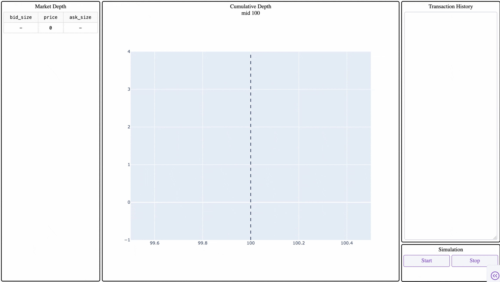

## Orderbook

Limit order book with price-time priority, heap-based price levels, and FIFO order queues, supporting partial fills and order cancellation. 

#### Overview
The core Orderbook has two sides (buy/bid and sell/ask) which are both represented as heaps (for O(logn) best-price lookups) and FIFO queues (for O(1) time-priority within a price level). 

- **_bestBid/_bestAsk**: both are min-heaps, but _bestBid is negated to have the highest price at root node; _bestAsk is stored normally.     
- **_queueMap(price, side)**: represented as deque of orders to have time-priority implementation; new orders are added to the end of the deque.   
- **_volumeMap(price, side)**: total volume for each price point, updated with each order placed and cancelled. 
- **_orderMap(orderID)**: maps new Orders based on their order_id. 

&nbsp;     

**Logic** - Compares new orders to opposite side's best order and moves outwards. If the order's price matches or crosses the opposing side's current best price, a transaction is made. If the entire volume is gone then it is removed **lazily** from the corresponding data structures. If partial volume is traded then appropriate changes to those prices are also made. 

**Lazy Deletion** - Instead of immediately removing the price from _bestBid or _bestAsk using list.remove(), the simulation pops it during the matching loop. On the contrary the price is removed from volume and queue maps immediately. When checking for stale prices in the frontend volume map is used. 

**Market Simulation** - A background thread generates synthetic order flow around an underlying price variable which is mutated using Gaussian distribution, with the ability to configure the probability to have "aggressive" orders. Aggressive orders guarantee a cross which is to prevent stale, unmatched liquidity from building up as the reference price drifts. 

**Frontend** - Dash dashboard with a table with 10 best bids/asks, a live graph showing cumulative market depth, and a transaction history for the 50 most recent transactions. 

### Demo

### How to run
1. Create a virtual environment through `python3 -m venv venv`
2. Run virtual environment using `source venv/bin/activate`
3. Install all dependencies using `pip install -r requirements.txt`
4. Run `python src/main.py` to locally host the web page
5. Go to `http://127.0.0.1:8050/` to view the dashboard
6. Click on `Start` button
